# Object-Oriented Programming - Hello World

In this lab, you will:

* Install Java 8.
* Write a basic program in Java 8.
* Compile and run your program in the command line.
* Install an Integrated Development Environment (IDE) for developing in Java.
* Rewrite and rerun your program using the IDE.
* Explore compiler and run time errors.

## Task 1 - Install Java 8

This task is for personal computers; everything we will install is already installed on the lab computers.

You can download Java 8 [here](https://www.oracle.com/technetwork/java/javase/downloads/jdk8-downloads-2133151.html). Click the link, and scroll down to the section titled **Java SE Development Kit 8u___** and download the appropriate installer based on your operating system.

Note that in order to download, you will need to create an Oracle account. Don't worry, Oracle will not spam you, but they might send occasional emails letting you know about updates to the version of Java that you've installed.

The terms SDK and JDK stand for "Software Development Kit" and "Java Developmebnt Kit" respectively. They will be used interchangeably for the rest of this lab.

Once the installer is downloaded, using it should be as simple as following the instructions. Leave any options presented during the installation process in their default state unless you know what you're doing!

Once you've installed, verify that your installation was done correctly: 

1. Open the terminal / command prompt / whatever your operating system (OS) calls the command-line interface.
2. Type `java -version`.
3. If the resulting message tells you what version of Java you have installed, success! If it instead says something along the lines of `unrecognized command "java"`, **panic**. Nah, just try to install again and ask for help if you keep having trouble, or use this as an opportunity to practice the programmer's most valuable skill: use of the search engine to solve technical problems.

## Task 2 - Create Your Java Project

In this task, we will create a minimal Java project. We will also learn the basics of navigation in the command line. Instructions will be offered for Mac and Windows; if you are on Linux, Ubuntu, etc you should follow the instructions for Mac. If you are on Windows, you may want to use WSL (Windows Subsystem for Linux) to follow the Mac instructions.

Open a new window in your command-line interface (from here on out we will refer to the command-line interface as the terminal, but for you Windows users "terminal" means "command prompt").

You should be in your user directory. That is, in the terminal, just before the cursor, the name of your user profile should be displayed.

Let's double check that you're in your user directory. Enter the following command based on your OS:

Mac: `pwd`

Windows: `echo %cd%`

These commands are to show your **current directory**, i.e. where the terminal is working in your file system. `pwd` is short for "print working directory". `cd` is short for `change directory` but in this context it might be more useful to think of it as `current directory`.

The result should be a path to your user directory. For me, the result is `/Users/ryan` because I am user `ryan` on my Mac.

If you are not in your user directory, you can navigate to it with the `cd` command as follows:

Mac: `cd ~`

Windows: `cd %HOMEPATH%`

Again, `cd` is short for `change directory`; this command allows you to change your terminal's working directory, so you can move through your file system. `~` and `%HOMEPATH%` are shorthands for your user directory. In place of `cd ~` I could have typed `cd /Users/ryan` and the result would be the same.

Now that you're in your user directory, check what is in that directory with the following command:

Mac: `ls`

Windows: `dir`

These commands both list the contents of the current working directory. Make sure that `Desktop` is in the list! If it's not, you're probably in the wrong place.

Next, navigate to the `Desktop` with the command `cd Desktop`.

Print your working directory again (`pwd` or `echo %cd%`); the result should be something like `Users/<your_name>/Desktop`.

Now that you're on your desktop, create a folder to put your first Java project in with the command `mkdir` followed by whatever you want to name the folder. If you want the folder to be called "COMP\_150\_Lab\_1" your command would look like `mkdir COMP_150_Lab_1`.

This new folder should have appeared on your desktop. If you minimize all of your windows, you should be able to see it! You can also run `ls` or `dir` depending on your OS and check that your new directory appears in the list.

Navigate into this new folder with `cd <folder_name>`. Mine is named `COMP_150_Lab_1`, so I did `cd COMP_150_Lab_1`.

This folder should be empty (we just created it and haven't added anything to it). Let's confirm that it's empty! Type `ls` or `dir` depending on your OS; nothing should happen, because the current directory has no contents to display.

## Task 3 - Write a Java Program

Let's create a new (empty) `.java` file called `HelloWorld.java`:

Mac: `touch HelloWorld.java` **or** `echo > HelloWorld.java`

Windows: `echo.> HelloWorld.java`

Again, run `ls` or `dir` to check that your new file is now in the folder.

You've now created an empty file; it's time to open and edit it.

Mac: `open HelloWorld.java`

Windows: `start HelloWorld.java`

The commands above will open your file with the default program associated with `.java` files on your computer. It might be a simple text editor, or it might be a full IDE if you've previously installed one and associated it `.java` files with it. If you want to edit your file in a different program, you will need to change the default application that your computer uses to open the file. If you want to do this, you're on your own, but the task is not difficult! Search "How to change file associations on \<your_OS\>".

So, you now have your file, `HelloWorld.java`, open in a text editor of some sort. Type or paste the following contents into the file:

```java
class HelloWorld
{
	public static void main (String[] args)
	{
		System.out.println("Hello World!");
	}
}
```

For now, we will only go over a very brief explanation of most of this program. The outermost layer is a definition of a class named `HelloWorld`:

```java
class HelloWorld
{
	...
}
```

Everything inside the curly braces `{}` is part of the `HelloWord` class.

Then, inside the class definition's braces, we have the definition of the **main method**:

```java
	public static void main(String[] args)
	{
		...
	}
```

Whenever you run a Java project, the instructions in the main method are the instructions that are executed. Other definitions will only be used if the main method references them.

For now, you don't need to know what `public`, `static`, `void`, or really any of this means. We'll cover the pieces of this in the coming lectures. For now, just accept that this is the minimal structure of a program in Java.

Finally, inside the main method, we have **the commands to be run when the program runs**.

```java
		System.out.println("Hello World!");
```

This line does what you might guess it does: it prints out the string "Hello World!".

If none of this makes sense right now, **don't stress it**. I basically just walked up and yelled a sentence at you in a language you don't speak. Understanding and fluency will come with patience, exposure and practice.

So, this program should print the message "Hello World!" in the terminal if we run it.

## Task 4 - Compile and Run

Unfortunately, we can't just run this program right off the bat. It is written in Java, a human-readable language. We need to **compile** it, i.e. translate it into instructions that are much less readable to use humans but that our computers can follow.

Don't worry, we don't have to perform this translation ourselves. The Java Virtual Machine will compile for us!

Save your file and close it. In the terminal, type the command:

```
javac HelloWorld.java
```

`javac`, short for "Java compile" a command to compile Java programs. If nothing happens in the terminal, this means compilation was successful. If you got error messages, go back and make sure the contents of your Java file match the contents above!

If the program compiled successfully, there should now be an extra file in your project called `HelloWorld.class`. This is the compiled version of the program. Feel free to open it up in a text editor, but you won't be able to read it!

This compiled version of the program can be read and its instructions can be executed by your computer. In the command line, type:

```
java HelloWorld
```

This should run your program. Below your command, the message "Hello World!" should have been printed to the console.

Congratulations! You've created, written, compiled and run a Java program!

## Task 5 - Install IntelliJ IDEA

An Integrade Development Environment (IDE) is an application to make editing and testing code easier. As gratifying as it can be to do everything in the command line, nobody has time for that.

IntelliJ IDEA is an IDE made by JetBrains specifically for editing and testing Java projects. It isn't normally free, but students can get it free for a year, every year, until they graduate.

First, sign up for a JetBrains student license [here](https://www.jetbrains.com/student/). Scroll down to the **"How do I Apply?"** section and click the **"APPLY NOW"** button to the right.

Fill out the form (using your student email) and follow JetBrains instructions from there.

Once you've signed up for a license, you're ready to install IntelliJ. Follow [this link](https://www.jetbrains.com/idea/download/) and download and install IntelliJ Ultimate.

Notice that IntelliJ also has a Community editition of their IDE, which is free even after you graduate. This free edition has all of the features we'll be using in this class.

## Task 6 - Redo HelloWorld in IntelliJ

When IntelliJ is done installing, run it. You'll be prompted for some preferences the first time you open IntelliJ, and you can leave them all in their defaults. Here you'll join either Team Light Mode or Team Dark Mode. Never associate with anyone who chooses Light Mode. They'll give you a headache. Never associate with anyone who uses Dark Mode. They'll waste all your time telling you about blue light.

Throughout the installation process and your first few uses of IntelliJ, it will occasionally offer you tips in pop-up windows. You may choose to go through the tips or not; these instructions will proceed as if the tip pop-ups never happen.

When you're done going through preferences, you should get a window that looks like this:

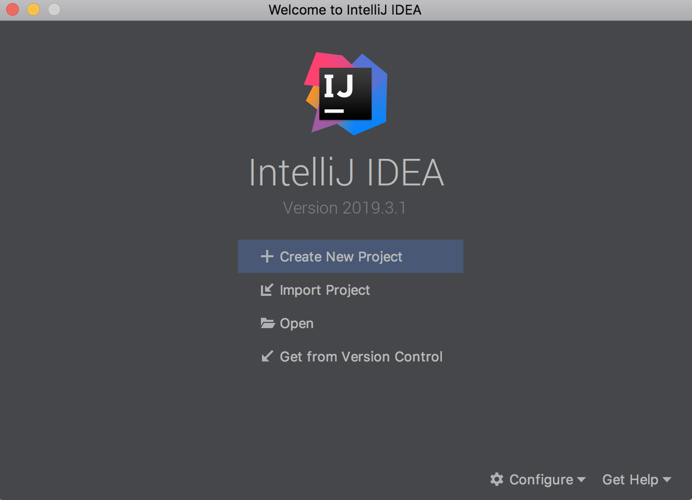

Click the **Create New Project** button. You should end up on a screen like this:

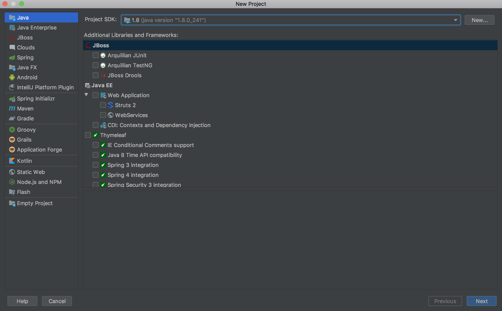

Make sure that **Java** is selected in the top left.

In the top-right, select **New...**

Here, you'll need to find the Java SDK that you installed earlier. On Mac, the default path to the JDK is

```
/Library/Java/JavaVirtualMachines/jdk<version>.jdk
```

On Windows, it is in the `Program Files` folder, under `Java`. In either case, the folder you want select should be named something like `jdk1.8.0_241.jdk`. The numbers might be different, if Java 8 has been updated.

Once you've selected your JDK, click **Next** in the bottom right.

Skip the next screen; hit **Next** in the bottom right a second time. You should end up here:

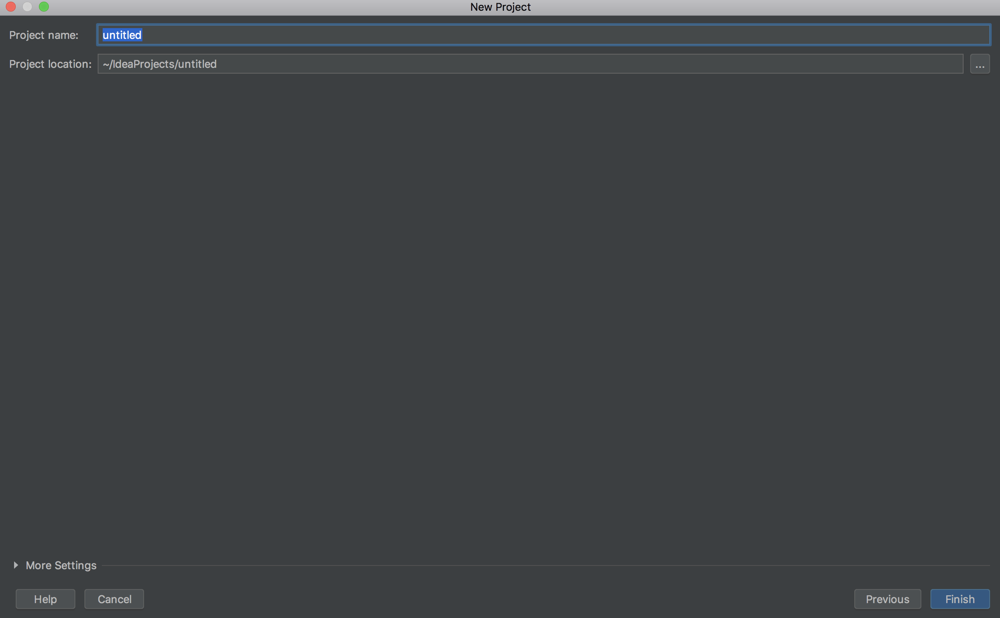

Here is where you get to name the project and choose where to put it on your computer. You likely want to put this project (and your future projects for this class) in the same place. On your desktop, right click and create a new folder name `COMP_150_Projects`.

Now, in IntelliJ, click the **...** to the right of the **Project location:** field. In the dialog that pops up, go to your desktop and select the folder you just created.

We want this specfic project to have it's own folder, so it will be separate from the other projects we put in the `COMP_150_Projects` folder later on. Add `/HelloWorld` to the end of the **Project location:** field. Finally, type **HelloWorld** in the **Project name:** field. It should look like this:

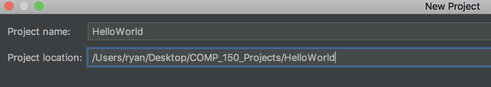

Select **Finish** in the bottom right. A dialog will pop up, warning you that the `HelloWorld` folder doesnt exist and will need to be created. This is fine; that's exactly what we want, for this project to create its own folder.

Your `COMP_150_Projects` folder should now have another folder in it named `HelloWorld`. Your IntelliJ window should look like this:

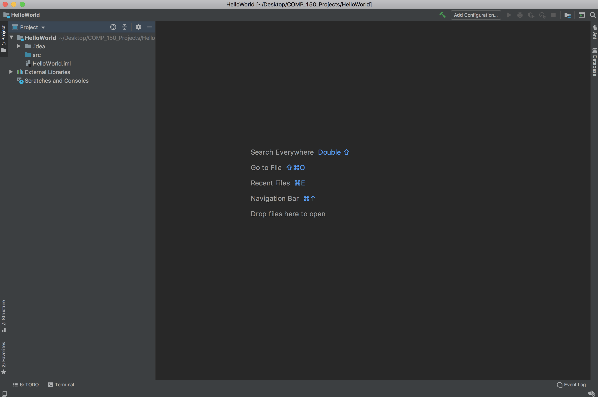

On the left side of the screen, you can see the **project pane**, which displays all of the folders and files in your project.

The project you just created is in a folder called **HelloWorld**. This folder is the one displayed at the top of the project pane. If you use your operating system's file explorer to open the project you've created on your desktop, you'll see it contains the same **src** and **HelloWorld.iml**. You may or may not be able to see the **.idea** folder in your file explorer, because it is a **hidden file** (its name starts with a period) meaning you can only see it if your file explorer is configured to display hidden files.

Let's go through the contents of the **HelloWorld** project folder in the project pane.

First, there is the **.idea** folder. This is a folder that **we will never touch**. It is for IntelliJ's use, and tracks data about how the project is configured for use in IntelliJ. You can delete the .idea folder at any time, and **your project will be fine**. A new .idea will be generated when you reopen the project, and you will have to open scripts again in the editor, but the content of your project will not change.

**TLDR**: We don't care about the .idea folder, it is for IntelliJ, not for us and not for our project.

Next, there is the **src** folder (short for "source"). This is where we live. This is where all of the Java files we write will be.

Finally, there is **HelloWorld.iml**. It stores data about the structure of the project and about project dependencies. For now, we will pretend it doesn't exist, but we'll talk more about its purpose in the future!

So the gist of this project summary was: **we only care about the src folder, for now**.

Let's create a new Java file in the src folder. In the project pane, right click the src folder, mouse over **New** and in the menu select **Java Class**.

You should get a dialog that looks like this:

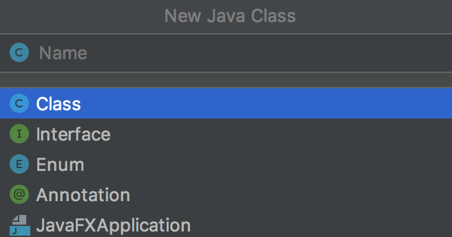

Make sure that **Class** is selected, and in the **Name** field type "HelloWorld" and hit the enter/return key.

Your IntelliJ screen should now look like this:

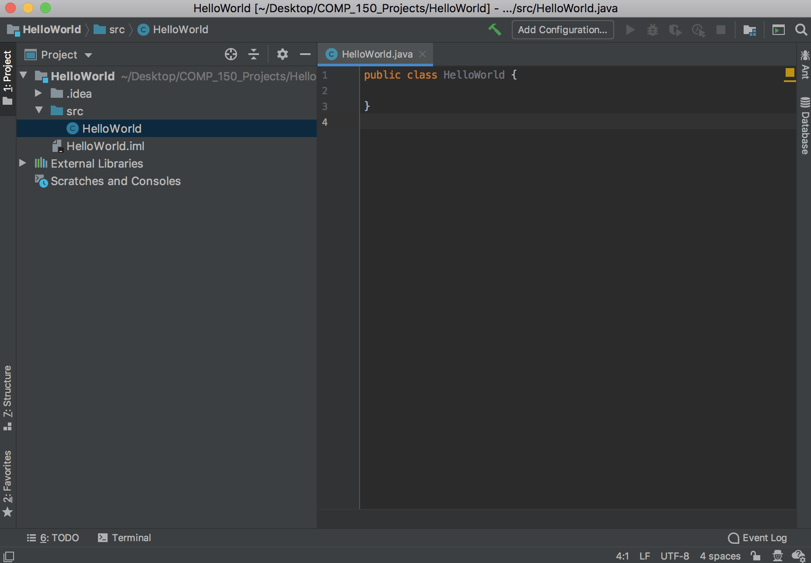

We've now created a new file, called **HelloWorld.java**, in the src folder. IntelliJ doesn't display the ".java" portion of the file name in the project pane; it instead indicates that HelloWorld is a Java file containing a Class definition with the `C` in a blue circle to the left of the file name.

**HelloWorld.java** has also been opened in an editor tab, to the right, and a class called HelloWorld with no contents has been created.

We're going to give this class contents very similar to those that we gave **HelloWorld.java** in our earlier project.

The class declaration is already made. We need to add a main method. Recall in the previous project we did this with the line `public static void main (String[] args)` followed by curly braces `{}` containing the contents of the main.

It turns out that `public static void main (String[] args)` is so frequently used in Java projects that the makers of IntelliJ created a shortcut for it. Click inside the `HelloWorld` class, and press tab once to indent. Then type `psvm` and hit tab again; IntelliJ will automatically fill in `public static...`.

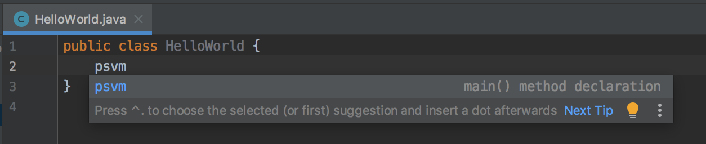

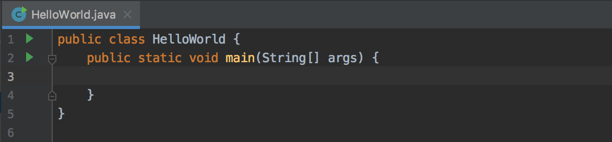

We could have typed the whole thing out by hand. In fact, you might prefer to type it out by hand for a while; you are learning a new language, and you'll get comfortable with the vocabulary and grammar faster if you type everything out by hand.

Let's fill out the contents of the main method now. Indented in the main method, type `System.out.println("Hello again, World!");`. Just like `psvm` served as a shorthand for `public static void main (String[] args)`, `sout` serves as a shorthand for `System.out.println();`, but you may want to avoid using this shortcut for now.

Your Java file should look like this:

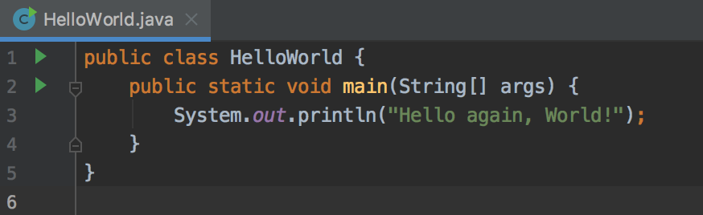

We're ready to compile and run the project. Click the **Build** menu (either at the top of the screen or the top of the window, depending on your OS) and select **Build Project**.

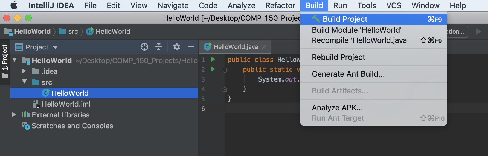

This will compile the project! After you build, a folder called **out** will appear in your project pane. If you open up the contained folders, you can find **HelloWorld.class**, the compiled version of **HelloWorld.java**.

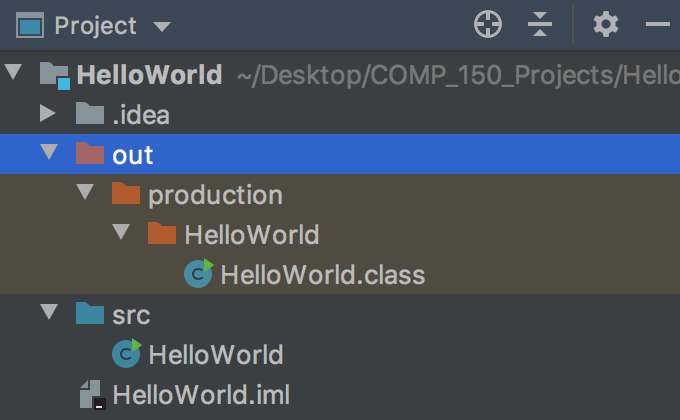

Next, we can run it. In the **Run** menu at the top, select **Run...**

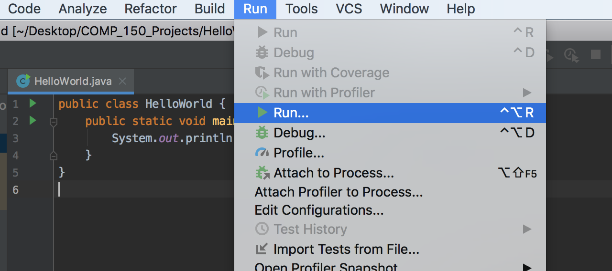

A dialog should pop up that looks like this:

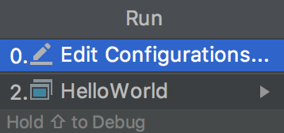

Select **HelloWorld**. There will be a brief pause; whenever you run in IntelliJ, it automatically compiles again for you to make sure that the compiled files (the ones being run) match your Java files. In other words, the steps we did earlier where we compiled using the **Build** menu were unnecessary (but sometimes you want to **just** compile and not run, so we did that anyway).

After the project finishes compiling, the program will run. A console should pop up at the bottom of your IntelliJ window, and it its contents should look something like this:

```
Hello again, World!

Process finished with exit code 0
```

First, we see the message (in quotes in **HelloWorld.java**) has been printed, as expected. Then we see the message `Process finished with exit code 0`. This is good. `exit code 0` means success; no errors happened while running.

An exit code with **any number other than 0** means that an error occurred while running (meaning there is a problem with your program that needs to be fixed). We generally don't need to use the exit code to determine what went wrong in Java; when something goes wrong, we get descriptive error messages that are much more helpful than some arbitrary number.

## Task 7 - Explore Errors

When you are writing programs, you will make mistakes. More runs will be unsuccessful than successful while you're developing. This will be true no matter how long you keep programming; you'll get more comfortable in smaller systems and move into larger ones where it is harder not to make mistakes. When errors exist in your code, it does not mean you're a bad programmer. Moreover, **programming is not a fragile task**. When you write a program and run it and it crashes, **there are no consequences**. Even in industry, where faulty code can have terrible consequences (say, accidentally deleting the contents of a database), you will rigorously test your code in a safe environment (with copies of the database) to make sure it's perfect before ever using it live. So, **don't be afraid to experiment and make mistakes**.

We've now successfully compiled and run the program. Let's explore what happens when the program either can't compile or can't run.

When the program can't compile, it means that the code typed in Java is invalid; the equivalent in spoken language would be the inability to determine what a sentence means due to bad grammar.

Let's make our project fail to compile. There are many ways we could do this, but for now we'll just cover one example. In Java, a **statement** is the equivalent of a **sentence** or a **command**. The semicolon `;` serves as the ending punctuation for the statement. Try deleting the semicolon at the end of the print statement:

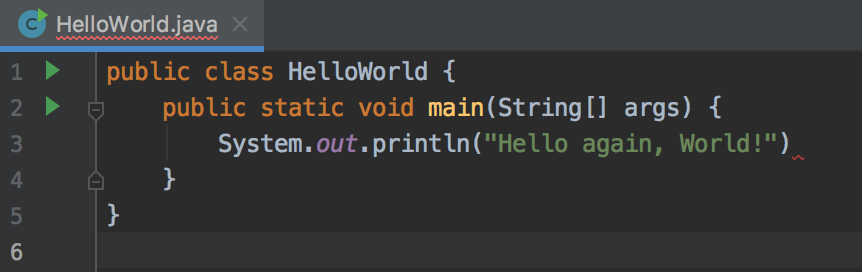

Before trying to compile this, note that IntelliJ has notified you of the error in two places:

First, the **HelloWorld.java** in the editor tab is underlined in red. This means "there is a syntax error in **HelloWorld.java**, so it won't compile." (A syntax error is roughly equivalent to a grammatical error).

Second, in **HelloWorld.java**, where the semicolon should be, there is another red underline, meaning "there is a syntax error RIGHT HERE." If you mouse over the red underline where the semicolon should be, you'll get an explanation:

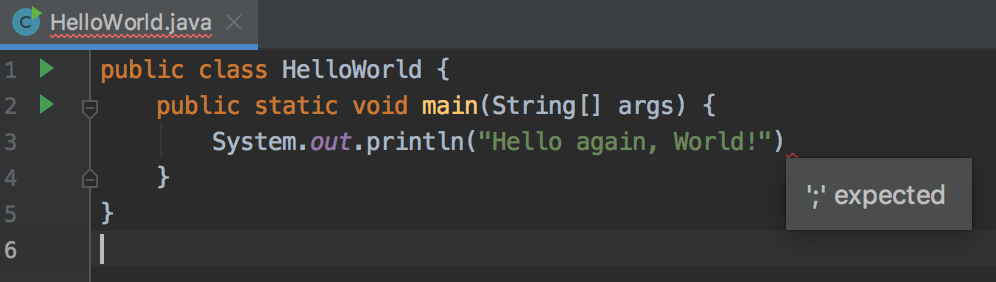

Mousing over the error clarifies what we already know: there should be a semicolon at the end of that line.

Before we fix it, let's try to compile. Again, in the **Build** menu at the top, select **Build Project**. This time, the project cannot compile because there is a syntax error. That is, the missing semicolon means that the Java file cannot be translated into machine code, because the Java file doesn't even make sense itself.

The compilation error is displayed at the bottom of the window, where the console was before:

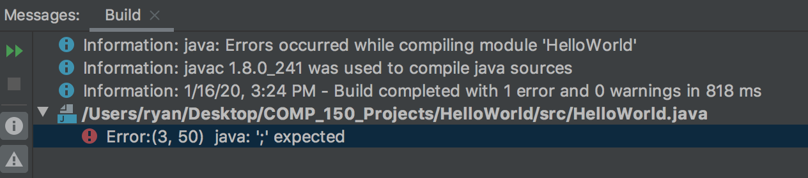

There is a second category of error, called a **runtime error** or an **exception**. A runtime error occurs when the instructions written in Java make sense, but they cannot be carried out. Let's create a runtime error.

Replace the contents of **HelloWorld.java** with the following code:

```java
public class HelloWorld {
    public static void main(String[] args) {
        int x = 1;
        int y = 0;
        System.out.println(x / y);
    }
}
```

What does this new script do? Well, first there is the statement `int x = 0;`. This statement creates a variable named `x`, of type `int`, and gives it value `1`. `int` is short for "integer"; `x` is essentially a box in which we can put an integer value, and we've chosen to put a `1` in that box.

Next, we create a second `int`, called `y`, and assign its value to be `0`.

Finally, we try to print out `x / y`. This means, print out the result of dividing `x` by `y`. But, since `y`'s value is `0`, this division will not be carried out successfully.

The lines in this file are syntactically correct (they have correct "grammar"; they form understandable statements). So, the program will compile correctly. Verify that the program builds correctly by using the **Build** menu to compile again.

When you build successfully, it looks like nothing happened. The errors from the previous unsuccessful build disappear, but nothing pops up to let you know that your build was successful. So, when you build and it looks like nothing happened, this is a good thing. It means the build was successful.

Now, let's try to run this new program. In the **Run** menu, select **Run...** and choose **HelloWorld** from the dialog.

This time, instead of a build error, the console will pop up (like it did in the first, successful run). But, instead of printing out the desired message (the quotient from `x / y`), a red message starting with the word `Exception` appears:

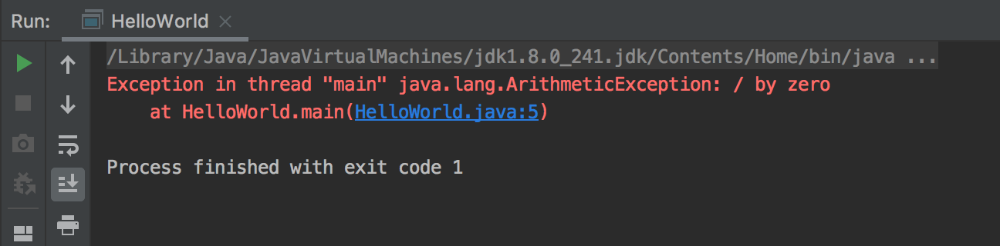

Reading the red exception message provides some details about what went wrong. Sometimes, the message can require some research to understand. In this case, the message is straightforward:

```
Exception in thread "main" java.lang.ArithmeticException: / by zero
	at HelloWorld.main(HelloWorld.java:5)
```

Let's dissect the error message:

`Exception in thread "main" java.lang.ArithmeticException:` means "there was a runtime error while running the thread called "main" of the program." (Don't worry about what "thread" means for now). 

The type of error was an `ArithmeticException` (i.e. a numerical calculation went wrong), which is defined in the `java.lang` package (we'll talk about packages later on).

`/ by zero` provides more detail about what the actual problem was: the program attempted to divide by zero.

`at HelloWorld.main(HelloWorld.java:5)`: the error occurred in the method called `main` defined in the `HelloWorld` executable in the file `HelloWorld.java`, on the `5`'th. It may seem redundant that it specifies both the `HelloWorld` executable and the file `HelloWorld.java`, but most projects consist of more than one file, so in general this extra information is helpful.

It is important to understand the difference between **compilation errors**, where the project can't be compiled / built, and **runtime errors**, where something goes wrong while the program is running. Being able to determine which type of error is occurring and to read the error messages to determine what is wrong is the among the first skills you'll need to build in order to be a successful programmer.

Whenever you get an error, **you should try to fix it yourself** by reading the messages and, if necessary, searching the internet for explanations from others who have had similar problems. You should only ask for help with an error after you've put in an honest effort to figure out what is wrong on your own. **This is not because I don't want to help you**, but because **figuring out what is wrong by interpreting error messages and researching the problem is integral to being a successful programmer**. It is a skill that you will never stop using and that you will never stop improving.

## Task 8 - Fix the Exception

Your task is to fix the exception that we created in the previous task. The end result should be **any program that builds and runs successfully**; the program doesn't have to do anything specific as long as it does something. Experiment for a while. Have fun! Think of something simple that you would like to do, and try to find out how to do it using your intuition, the search engine, and the fearlessness that comes from knowing that no errors you create will cause any real problems. Once you have a program that successfully builds and runs without any compilation errors or runtime errors and you're satisfied with your experimentation, you're ready to submit.

## Task 9 - Submit

When you're ready to submit, zip up your project and submit it on Canvas under Lab 1.

If you've never created a zip file before, don't worry, its easy.

If you're on Mac, simply open your **COMP\_150\_Projects** folder, right click the **HelloWorld** folder, and click **Compress "HelloWorld"**. Note that the names of the folders will be different if you named yours differently than I did mine earlier in the tutorial, but the idea is the same. The result should be a folder named **HelloWorld.zip**, which is what you should submit.

If you're on an OS other than Mac, you may have to download a tool that allows you to zip up your project (or you might not, it depends on your OS and what version of that OS). Search "how to zip on \<your_OS\>" and go from there.

